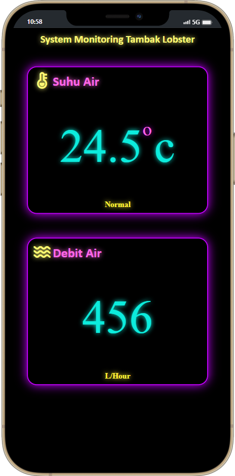

<h1>Real Time Heat & Water Flow Monitoring System</h1>
<h4>Hardware & Sensors</h4>
<ul>
<li>Arduino Uno</li>
<li>NodeMCU ESP8266</li>
<li>DS18B20 Temperature Sensor</li>
<li>Water Flow Sensor</li>
</ul>
 <h6>App Preview:</h6>
 
